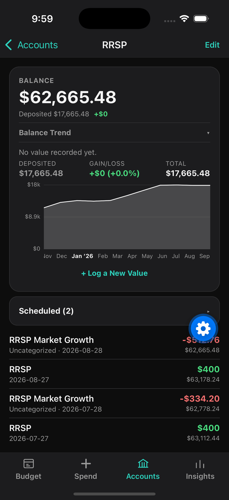
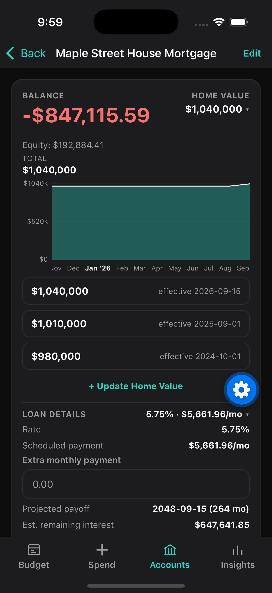

# ByoBudget — Build Your Own Budget

> 🚧 Work in progress.

Free, privacy-first, YNAB-style budgeting for iOS. Envelope budgeting, common financial calculators, and optional AI analysis — no backend, no subscription.

See [`docs/DESIGN.md`](docs/DESIGN.md) for the design doc and [`docs/IMPLEMENTATION_PLAN.md`](docs/IMPLEMENTATION_PLAN.md) for the implementation plan.

## Core
- YNAB-style envelope/zero-based budgeting
- Financial tools: mortgage / interest / payment calculators
- AI analysis (bring your own API key)

## Storage
- Local (SQLite): single source of truth
- iCloud: backup option
- S3: backup option

## Privacy
- S3: provisioned by user, grant app access
- AI: user's own API key, usage auditable in the provider's own dashboard

## Development
Expo (React Native, TypeScript).

```
npm install
npm start
```
Opens Expo Go — quick iteration, but native modules (sqlite, secure-store, sharing) run in Expo Go's own shell, not the real app.

### Local builds need Xcode 26.4+
SDK 57 requires Xcode 26.4 / Swift 6.3. Xcode 26.3 is the last version that runs on macOS
Sequoia, and it fails in `expo-modules-jsi` — `SWIFT_RETURNS_RETAINED` on the `RuntimeScheduler`
constructors, then `sending '...Ptr' risks causing data races` in `JavaScriptRuntime.swift`.
Not patchable in practice. On Sequoia specifically, build in the cloud (EAS, below); on Tahoe
with a current Xcode, build locally — it's faster and needs no Apple Developer membership.

### Real app on simulator (not Expo Go)
```
npx eas-cli build --profile preview --platform ios --non-interactive
```
Then download the `.tar.gz` from the printed artifact URL, extract, and install:
```
tar -xzf app.tar.gz
xcrun simctl install booted BYOBudget.app
xcrun simctl launch booted com.solomonxie.buildyourownbudget
```

### Real app on an iPhone (plugged in)
The everyday path. Local Xcode build straight onto the device — no EAS, no provisioning
profiles to register, no Apple Developer membership. Trust the Mac on the phone once, then:

```
xcrun devicectl list devices                                    # grab the UDID
npx expo run:ios --device <udid> --configuration Release
```
Drop `--configuration Release` for a debug build that attaches to Metro. Release bundles the
JS in, so the app runs standalone with no dev server.

Signing is automatic from whatever team Xcode already has. First build from cold is slow
(~5–10 min); later ones reuse DerivedData.

### Real app on an iPhone (over the air)
For a phone that isn't plugged into this Mac. Needs a paid Apple Developer Program
membership. Ad hoc signing: the build is locked to device UDIDs registered *before* the
build.

```
npx eas-cli device:create          # once per phone — pick "Website", scan QR, install profile
npx eas-cli build --profile device --platform ios
```
Log in with the Apple ID when prompted; EAS creates the distribution cert and provisioning
profile. When the build finishes, open the printed URL on the phone and tap Install.

New phone later → `device:create`, then `eas build:resign` (no full rebuild).

For more than a handful of testers, use TestFlight instead — no UDIDs, but App Store Connect
review/processing between each build:
```
npx eas-cli build --profile production --platform ios
npx eas-cli submit --platform ios --latest
```

## Screenshots
| Budget | Insights | Account Trend | Mortgage |
|---|---|---|---|
|  |  |  |  |
