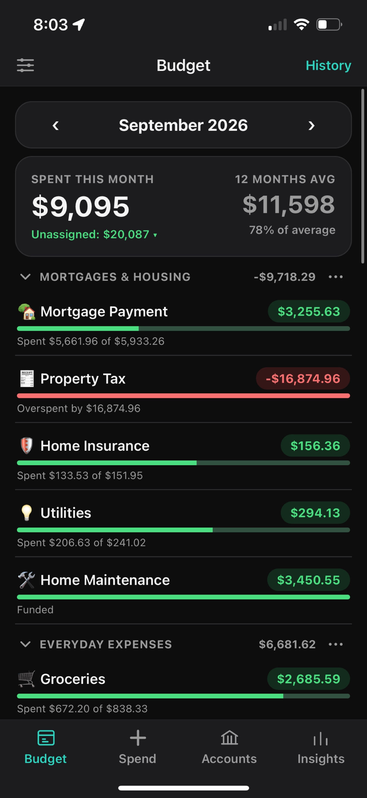
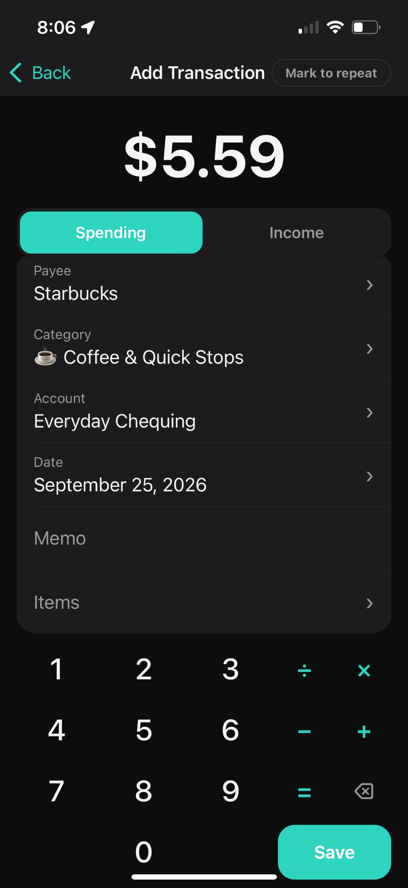
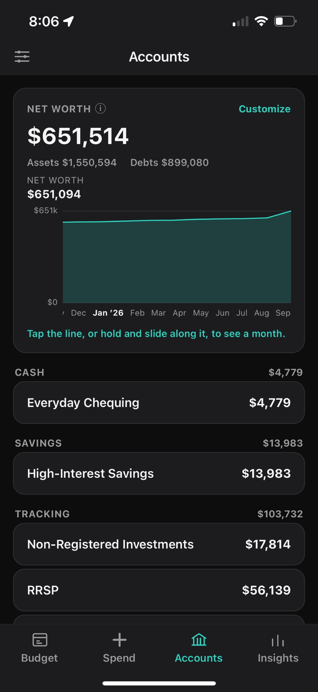
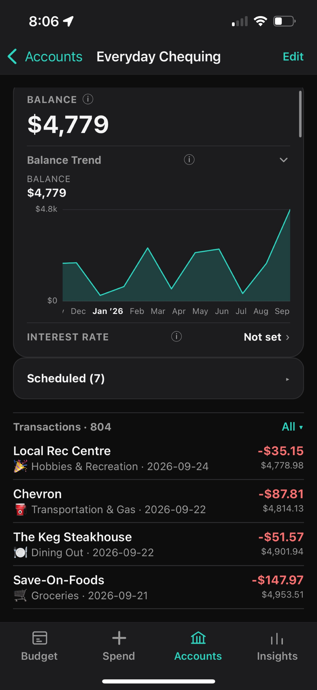
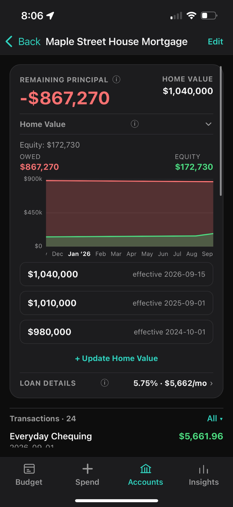
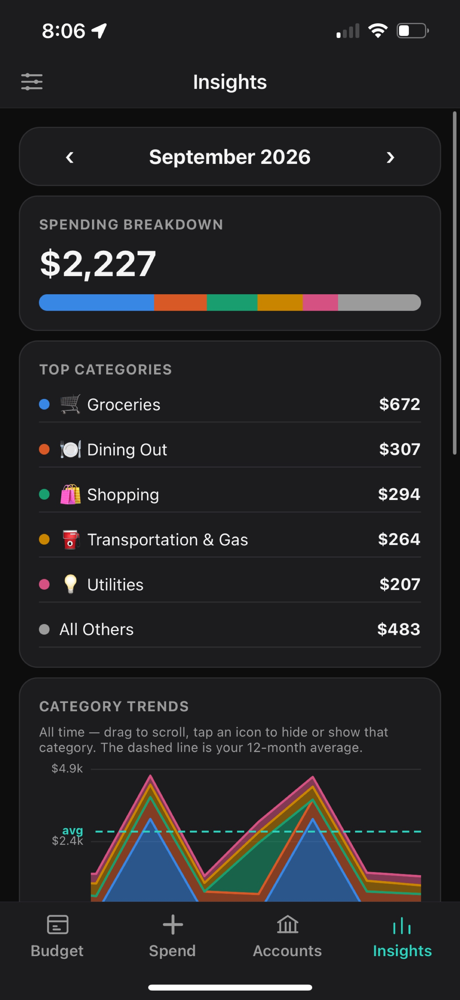
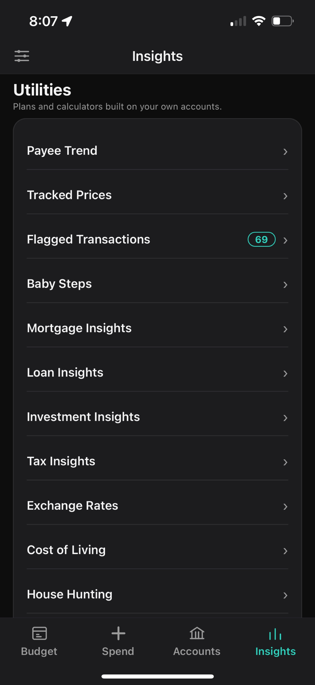
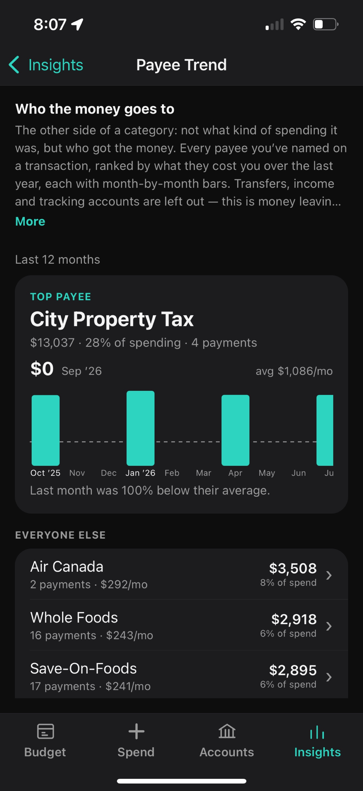
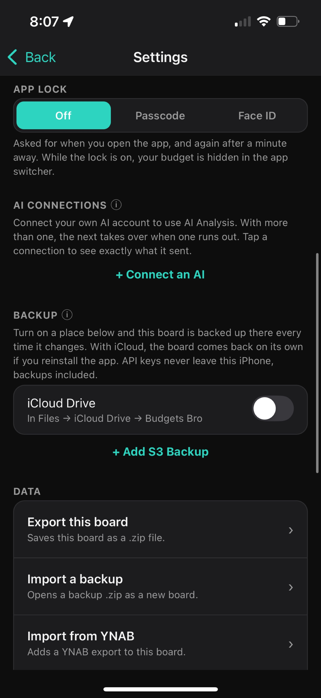

# Budgets Bro

> 🚧 Work in progress.

Free, privacy-first, YNAB-style budgeting for iOS. Envelope budgeting, common financial calculators, and optional AI analysis — no backend, no subscription.

See [`docs/DESIGN.md`](docs/DESIGN.md) for the design doc and [`docs/IMPLEMENTATION_PLAN.md`](docs/IMPLEMENTATION_PLAN.md) for the implementation plan.

## Core
- YNAB-style envelope/zero-based budgeting
- Financial tools: mortgage / interest / payment calculators
- AI analysis (bring your own API key)

## Storage
- Local (SQLite): single source of truth
- iCloud Drive: backup option — the app's own folder, visible in Files
- S3: backup option

## Privacy
- iCloud: the user's own account and storage quota; nothing passes through a server of ours
- S3: provisioned by user, grant app access
- AI: user's own API key, usage auditable in the provider's own dashboard

## Development
Expo SDK (React Native, TypeScript) built and run as a **native app only** — no
Expo Go, no dev server. See [`docs/DESIGN.md`](docs/DESIGN.md#no-expo-go-no-dev-server)
for why.

```
npm install
npm run ios          # Release build → installs and launches on a plugged-in iPhone
```

Needs a **paid** Apple Developer Program membership (Individual is fine): a free
personal team cannot sign the iCloud capability, and `app.json` carries that
entitlement for the iCloud backup destination. Trust the Mac on the phone once,
then `npm run ios` does the rest — it picks the connected device itself, or takes
a UDID: `scripts/install-ios-device.sh <udid>`.

First build from cold is slow (~10-20 min); later ones reuse DerivedData under
`/tmp/budgetsbro-device`.

`ios/` is a real Xcode project, committed and edited by hand — there is no
prebuild step to regenerate it. After adding a native dependency, or if the
project folder moves (CocoaPods bakes absolute paths and the build fails on the
old one):
```
cd ios && pod install
```

### Xcode 26.4+ required
SDK 57 requires Xcode 26.4 / Swift 6.3. Xcode 26.3 is the last version that runs on macOS
Sequoia, and it fails in `expo-modules-jsi` — `SWIFT_RETURNS_RETAINED` on the `RuntimeScheduler`
constructors, then `sending '...Ptr' risks causing data races` in `JavaScriptRuntime.swift`.
Not patchable in practice. On Sequoia specifically, build in the cloud (EAS, below).

### Over the air, for a phone that isn't plugged in
Ad hoc signing: the build is locked to device UDIDs registered *before* the build.

```
npx eas-cli device:create          # once per phone — pick "Website", scan QR, install profile
npx eas-cli build --profile device --platform ios
```
New phone later → `device:create`, then `eas build:resign` (no full rebuild).

For more than a handful of testers, TestFlight instead — no UDIDs, but App Store
Connect review/processing between each build:
```
npx eas-cli build --profile production --platform ios
npx eas-cli submit --platform ios --latest
```

## Screenshots
| Budgets | Spent | Accounts |
|---|---|---|
|  |  |  |
| **Chequing** | **Mortgage** | **Insights** |
|  |  |  |
| **Insights (cont.)** | **Payee Trend** | **Settings** |
|  |  |  |
